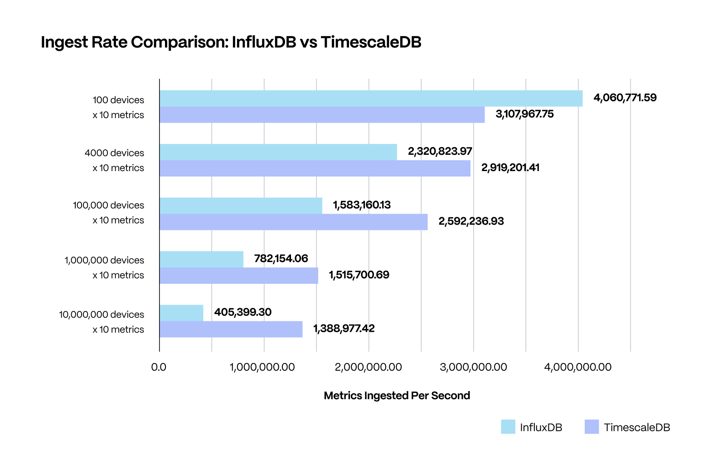
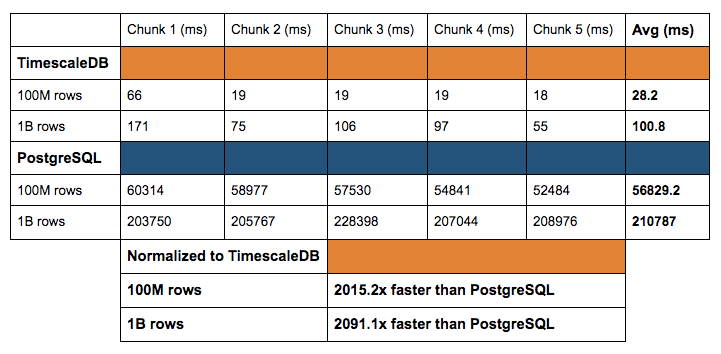
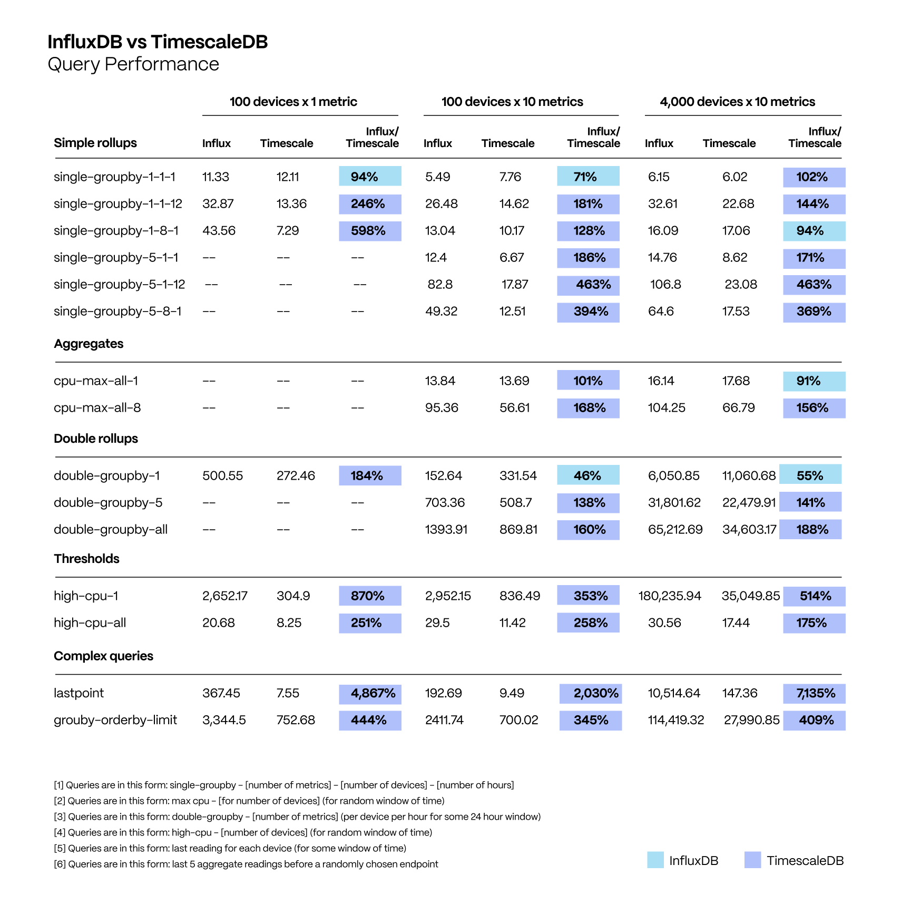
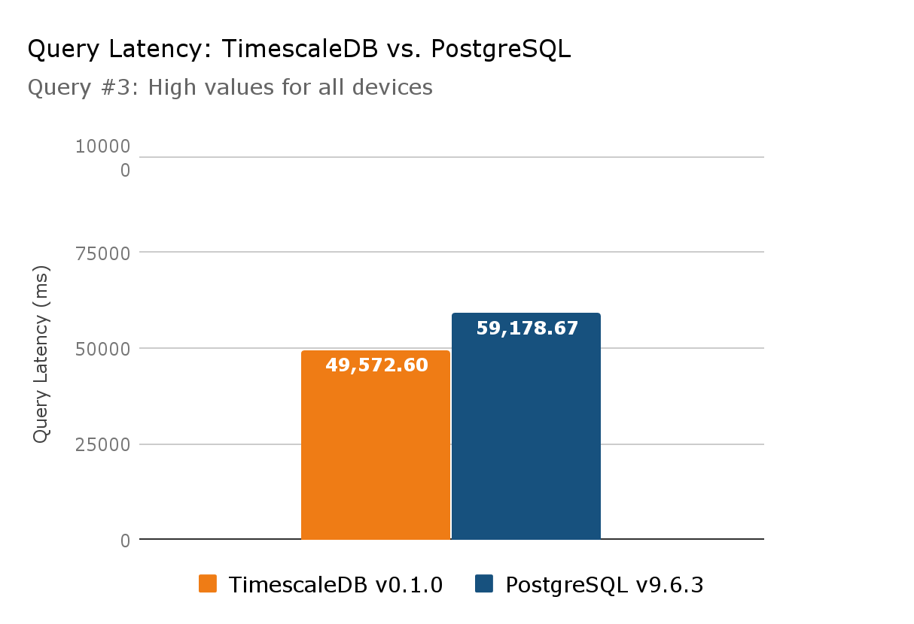

# Timeseries based data efficiency in PostgreSQL vs InfluxDB vs TimescaleDB(PostgreSQL extension)

## Timeseries Data
Timeseries data or temporal data is a sequence of data points collected over time intervals, allowing us to track changes over time. Time-series data can track changes over milliseconds, days, or even years. Example of timeseries data includes IoT sensor generated data, monitoring data, financial transaction data, etc.

Unlike usual data, timeseries data needs to be stored and organized by taking time, as an attribute, into consideration for faster and more efficient storage, data ingestion and queries.

## Databases into consideration:
### 1. PostgreSQL
PostgreSQL is a relational database which stores timeseries data just as any other data. It take time into special consideration while storing and organizing the data and treats time as just another attribute. This leads to slower data ingestion and query time.

### 2. InfluxDB
InfluxDB is a NoSQL database which is purpose-built for time-series data. It has a native data model that efficiently organizes and stores time-stamped data points. InfluxDB uses a unique index structure, the Time-Structured Merge Tree (TSM), which is optimized for time-series data. This allows for high write and query performance, especially when dealing with large volumes of time-stamped data. It also offers an SQL like language for querying data, called InfluxQL.

### 3. TimescaleDB (an extension of PostgreSQL)
TimescaleDB is an open-source time-series database that is built as an extension to PostgreSQL. It is designed to provide the scalability and performance needed for handling large volumes of time-series data while leveraging the familiarity and power of PostgreSQL.It introduces a new abstraction called a "hypertable" to manage time-series data. A hypertable is a distributed table that is sharded across multiple chunks, each containing a time range of data.TimescaleDB automatically creates and manages chunks based on time intervals, simplifying the process of data partitioning and retention.

## Feature Comparision Overview

| Feature/Aspect          | PostgreSQL                                   | InfluxDB                                  | TimescaleDB                             |
|--------------------------|----------------------------------------------|-------------------------------------------|-----------------------------------------|
| **Data Model**           | General-purpose relational database          | Time-series focused, native data model    | Time-series extension to PostgreSQL     |
| **Indexing**             | B-tree indexes                               | Time-Structured Merge Tree (TSM)          | Multi-dimensional indexing, B-tree       |
| **Retention Policies**   | Manual management required                   | Built-in support                          | Automatic creation and management      |
| **Query Language**       | SQL                                          | InfluxQL                                  | SQL (compatible with PostgreSQL)        |
| **Continuous Queries**   | Supported                                    | Supported                                | Continuous aggregations for optimization|
| **Clustering/Scaling**   | Horizontal scaling using sharding            | InfluxDB Enterprise for clustering       | Horizontal scaling with distributed hypertables|
| **Compression**          | Dependent on storage engine and configuration | Supports compression                    | Compression for efficient storage       |
| **Parallel Processing**  | Yes                                          | Limited                                    | Yes (utilizes PostgreSQL capabilities)  |

## Some Benchmarks

### Data Ingestion

### Data Querying

### Notes:
It might be difficult to find online hosted timescaledb, but timescaledb themselves also offer online hosted db services. But AWS's postgres's based RDS can't be configured to use timescaledb extension [Source](https://www.youtube.com/watch?app=desktop&v=W-ouPw944CM)

### Other Sources:
1. [Article 1](https://timescale.com/blog/timescaledb-vs-influxdb-for-time-series-data-timescale-influx-sql-nosql-36489299877/)
2. [Article 2](https://www.influxdata.com/comparison/influxdb-vs-timescaledb/)